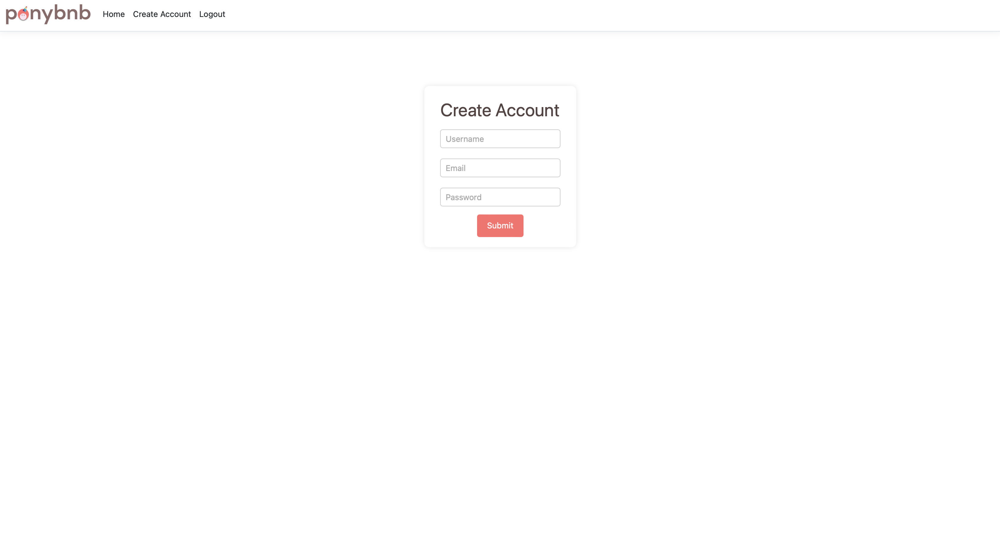
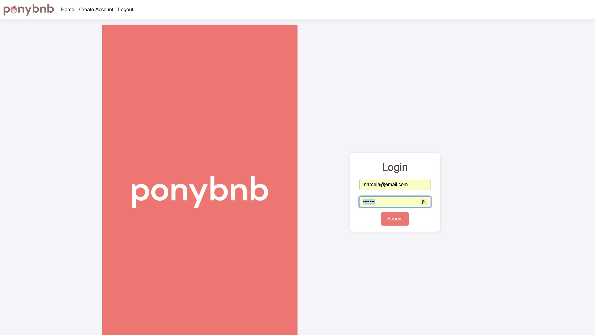
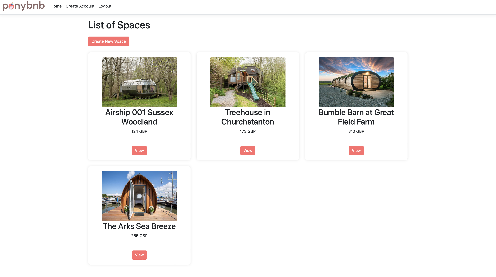
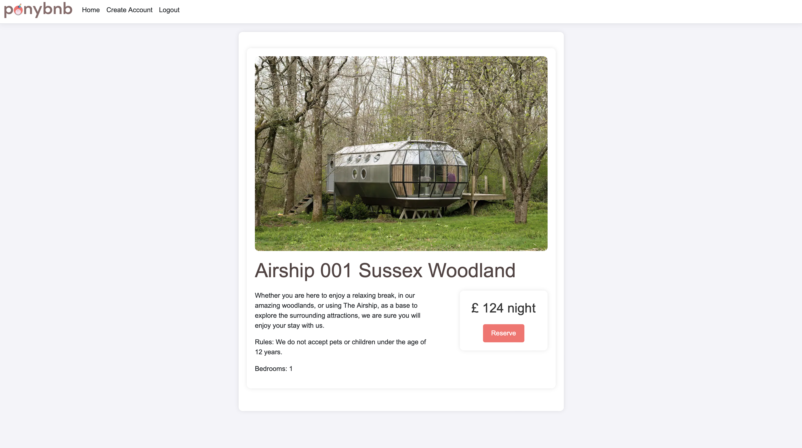
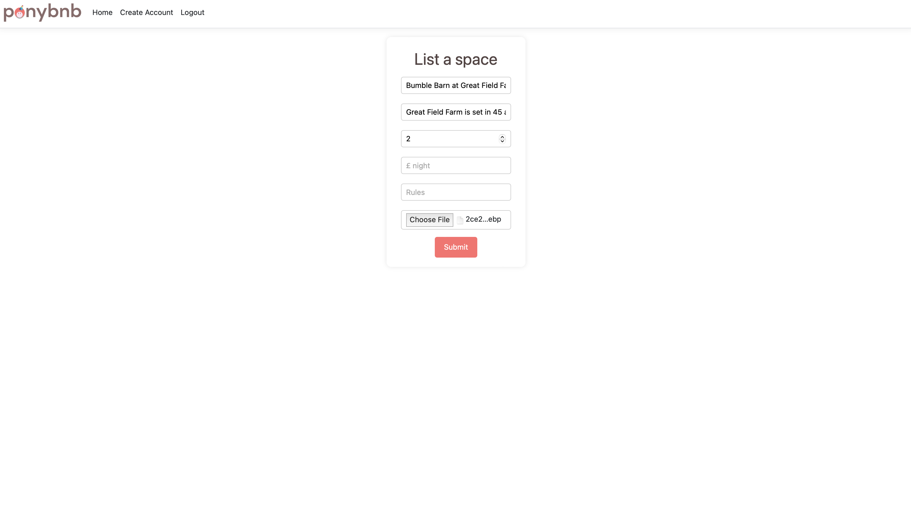
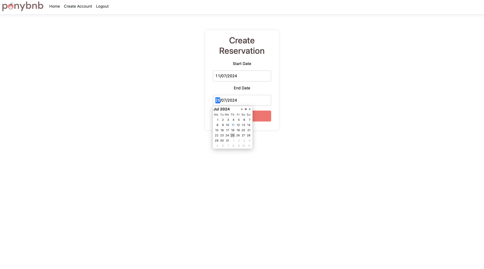
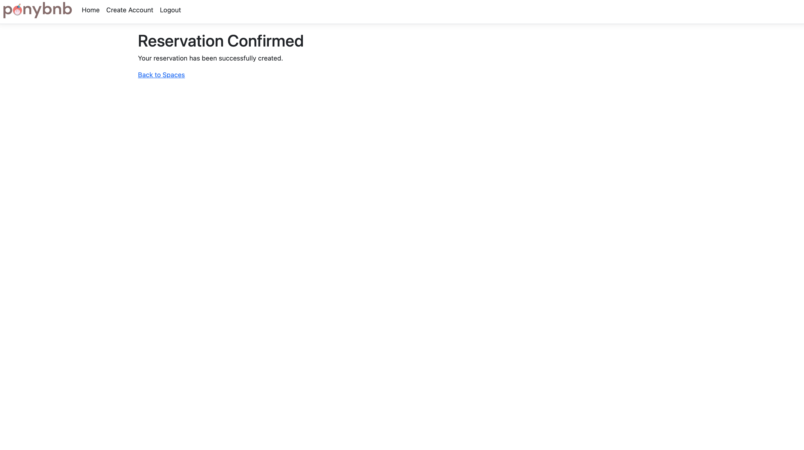

# PonyBnb: AirBnb-like Application

This solo project is a work in progress developed as part of the Makers Bootcamp C# Fundamentals and Web Application course. The project aims to create an MVP where users can create accounts, log in, view a list of spaces and their details, post new spaces, reserve spaces, and log out.

Overview
Challenge Source: Makers Bootcamp
Project Type: Airbnb-like Application
Features: Account creation, login, list of spaces, space details page, post new spaces, reserve spaces, and logout.

## Tech Stack

For this app we will be using the following tech stack:
- C#, ASP.Net, .Net, Razor, NUnit, PostgreSQL, HTML, CSS
- MVC Architecture

## Features

- Account Creation: Users can create accounts with passwords, emails, and usernames.
- Login Page: A login page is available where users can log in to their accounts to view a list of spaces, create new spaces, or make reservations.
- Home: A list of spaces already created for all users.
- Details: A page with all details about a specific space.
- Reservation: Allows users to create a new reservation for a specific space.
- Create New Space: A form to create a new space, including all necessary information and an image.

## Application

|   Description    |   Page Image    |
|:------------:|:----------------:|
|Account Creation Page| |
|Login Page| |
|Home Page| |
|Details Page| |
|New Space Page| |
|Reservation Page| |
|Confirmation Page| |
